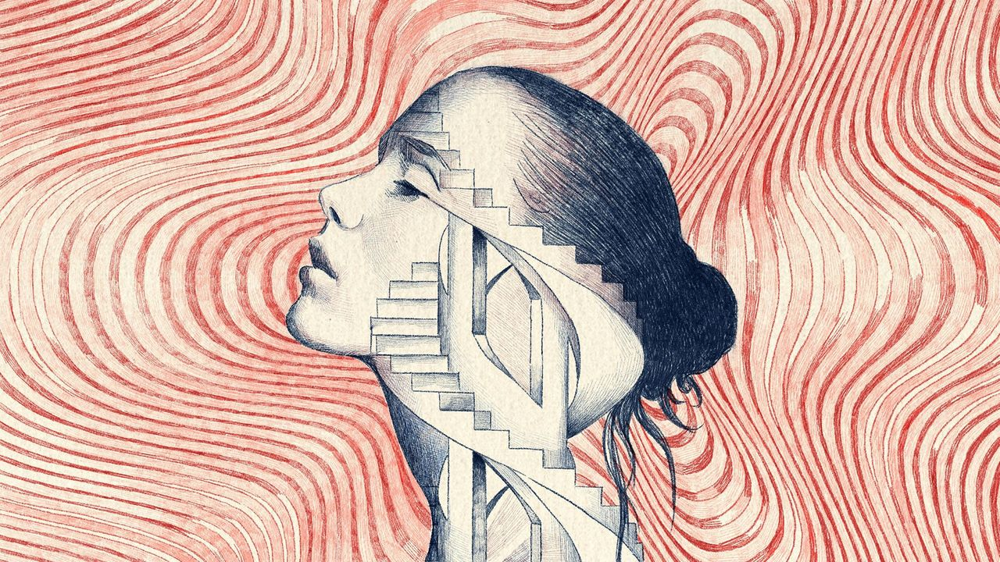
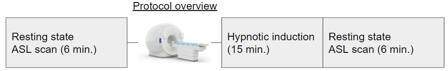
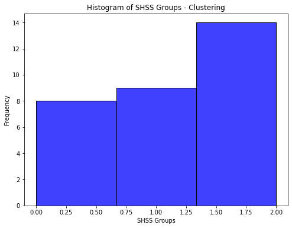
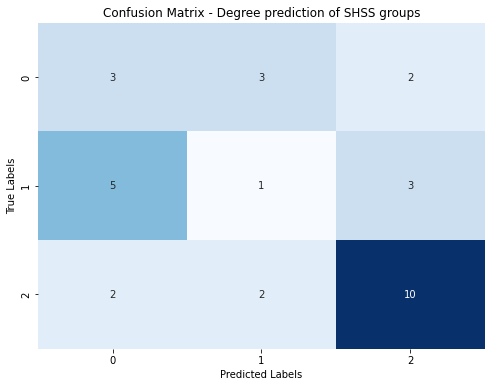
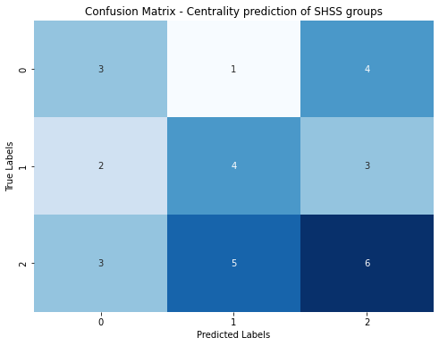
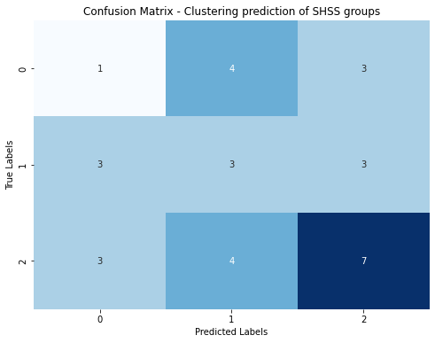
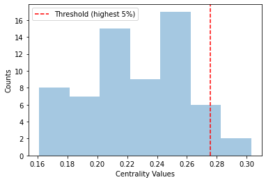
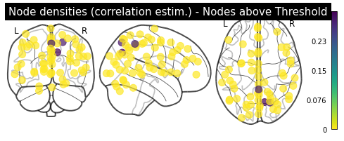

<div style="text-align: center;">
   
</div>


Summary: "This project aims to better understand neural correlates of hypnosis, which is defined as an experiential experience of focused attention and heighten reponse to suggestions. Hypnotic experience can be assessed in part trough the feeling of automaticity associated with hypnotic experience, with hypnotic depth measures and with hypnotizalibility scores. The brain's functionnal connectivity might reflect which brain regions interact together to produce the subjective change in phenomenological experience associated with hypnosis. We used Arterial Spin Labeling fMRI (Siemens 3T) data acquired at rest (from Rainville et al., 2019), both before and after hypnotic induction. The functional connectivity matrix for each subject was computed, for each condition (pre and post hypnosis) and then substracted to extract the contrast connectivity (post-pre hypnosis) induced by hypnosis. We then used the contrast connectivity matrices and graph theory metrics extracted from the connectomes (degree, clustering and centrality) to predict hypnosis-related behavioral variables. A 10-fold (80:20 train-test split) ridge regression was trained to predict (separately) the dependent variables.'


tags: [ASL-fMRI, hypnosis, connectome, ML]


# 1. Background
Hypnosis is defined as an experiential state of focused attention and heightened response to suggestions. Hypnotic experience can be assessed in part with the automaticity associated with hypnotic experience, with hypnotic depth and with hypnotizalibility scores. Efficiency of hypnosis to modulate pain is well grounded in litterature (see Thompson et al., 2019 for a systematic review).

For a informative discussion about neural correlates involved in hypnosis and clinical implications, by David Speigel, see [this link](https://www.youtube.com/watch?v=PctD-ki8dCc).

## Data

### *Arterial spin labelling protocol*
Data Used comes from [Rainville et al. (2019)](https://pubmed.ncbi.nlm.nih.gov/31526265/) and hypnosis was used during the fMRI scanning acquisition with a Simens 3T scanner.

*Outline*

>33 participants (female=17,male = 16,  27 y.o mean)
>
>* 2 resting state scans (6 minutes each)
>* Conditions : Pre-hypnosis, Post-hypnosis
>* Hypnosis-related measures  
>   - Standford hypnotizability scale (SHSS)
>   - Hypnotic depth (HDS)
>   - Hypnotic automaticity (HAS)
>   - Hypnotic experience (HEQ)
   

 A 6 minutes resting state scan was first acquired at the beginning of the protocol (pre hypnosis). Other pain-related tasks detailed in [Desmarteaux et al. (2021)](https://www.frontiersin.org/articles/10.3389/fpain.2021.757384/full) were performed following the initial resting state acquisition. These tasks invlove a series of painful stimulations coupled with hypnotic suggestions to either increase or decrease the pain. Some variables related to this part of the protocol were used in the present project as dependent varibles (e.g. the efficiency of pain modulation induced by hypnosis). Other hypnosis-related measures are derived from this part of the protocol, e.g. measures of feeling of automaticity, mental relaxation and hypnotic depth. At the end of the protocol, participant took part in a 15 minutes hypnotic induction prior to a second (post hypnosis) resting state scan (6 minutes).

The functional MRI signal is **Arterial splin labeling** which measure crebral blood flow over time. Altough this signal is not as precise as the BOLD signal (lower S/N ratio), it has the advantage of being absolute and not relative to a baseline. This is particularly useful for the resting state scan, as the baseline is not well defined.


<div style="text-align: center; background-color: white; border: 1px solid #000; padding: 20px;">
   
</div>

> **Note on pain modulation* :
   Other tasks in the scanning protocol - aside from the 2 resting state scans- included conditions of verbal suggestions either to increase (hyperalgesia cond.) or to decrease (analgesia cond.) pain experience prior to a series of painful stimulation. Subjective pain was assessed after each trial of [verbal suggestion + painful stimulations]. The difference between the pain ratings in the neutral condition and the pain ratings in the analgesia/hyperalgesia condition was computed for each subject. The absolute change in pain modulation was then used as a regressor in the analysis.

### *Data availability*
   Data access is unfortunately restricted from public open access. However, group results can be shared on demand. Please contact me at dylan.sutterlin-guindon@umontreal.ca


### *Deliverables*

1) A github repository with all the code and documentation organized in a standard way; main.py, src, scripts, images, notebooks and a README.md (this document) file.
2) A jupyter notebook with the prediction analyses and plots used in this report.


# 2. Method

### Section overview

#### 2.1 Atlas choices
   - Yeo7 atlas
   - Dictionary of Functional Modes (DiFuMo) 64 ROIs atlas
#### 2.2 Connectivity estimation methods and trade-offs
   - Pearson correlation
   - Partial correlation
   - Tangent space embedding
#### 2.3 Extraction of hypnosis-induced connectivity  
#### 2.4 Graph theory measures
#### 2.5  Prediction of hypnosis-related variables from functionnal connectivity


## 2.1 <em>_Atlas choices and covariance estimation_</em>

_The following section on the Yeo atlas is mainly to ground this project in a knowledge sharing perspective and for transparacy, as this atlas was not utlimately the one chosen for the main analyses. The DiFuMo atlas, presented after, was used for the project._
___
### **Yeo et al. 7 networks**
<div style="text-align: center; background-color: White; border: 5px solid #000; padding: 0px;">
   
</div>

* **Atlas from [Yeo et al, 2011](https://www.ncbi.nlm.nih.gov/pmc/articles/PMC3181453/)**

      from nilearn import datasets
      atlas = datasets.fetch_atlas_yeo_2011()["thick_7"]


   This atlas was first consider for its parcimony as it only comprises 7 networks. With that many ROIs, the number of possible pairs is 21 and it would not be desirable to have too much regressors in  multiple regression models where we have few samples. is a *deterministic atlas*.
   As metionned in the [nilearn docs](https://nilearn.github.io/dev/modules/generated/nilearn.datasets.fetch_atlas_yeo_2011.html) :
   
      "A deterministic atlas is a hard parcellation of the brain into non-overlaping regions, that might have been obtained by segmentation or clustering methods. These objects are represented as 3D images of the brain composed of integer values, called ‘labels’, which define the different regions."
   This implies the use of [**Nilearn.maskers.NiftiLabelsMasker**](https://nilearn.github.io/dev/modules/generated/nilearn.maskers.NiftiLabelsMasker.html) class to extract timeseries from each regions of interest (ROI).

*/ **Symetrical bilateral mask** 

   Since the atlas is symetrical, it is labeled bilaterally with the same label in the left and right hemispheres. When the connectivity matrix is directly computed on this atlas, it renders a symetrical connectome without inter-hemispheric connections, as illustrated in this connectome from a [nilearn tutorial](https://nilearn.github.io/dev/auto_examples/03_connectivity/plot_atlas_comparison.html#sphx-glr-auto-examples-03-connectivity-plot-atlas-comparison-py) :

   

   *Compute inter-hemispheric connectivity*

   To account for this, I had to relabel each ROI with a different label for the right hemisphere. This was done locally with the `scripts.func.make_mask_bilat(atlas)` function, that take each ROI and duplicate it with a different label for the right hemisphere. Hence, after this tweak, the atlas had 14 ROIs and the number of possible pairs is now of 91! 

___
### **DifuMo Atlas**
   *Fine-grain atlas of functional modes for fMRI analysis*

* This atlas is originally presented in [Dadi et al, 2020](https://www.sciencedirect.com/science/article/pii/S1053811920306121)
* Can be downloaded [here](https://parietal-inria.github.io/DiFuMo/64)
   - Note that finer parcellation of the atlas are also available [here](https://parietal-inria.github.io/DiFuMo)
* **Labels are provided** 
Exemple of ROI/modes shown on the website

<div style="text-align: center; background-color: White; border: 5px solid #000; padding: 0px;">
   
   
</div>

* It is a probabilstic atlas (4 dimenional Nifti file of shape Xdim, Ydim, Zdim, Number of ROIs). Each 3D slice of this 4D file contains a ROI. Hence, some voxels can be in more than one ROI. 

_Image from Dadi et al. (2020), e.i. the article introducing the DiFuMo atlas._ 


It shows the *'Comparison of modes overlap for all proposed DiFuMo atlases. The y-axis shows how many voxels are at the intersect of exactly n modes (x-axis), without thresholding the modes. On average, at least two modes are shared between voxels.'*(Dadi et al. 2020)


This atlas was chosen for its balance between parsimony (64 ROIs) and for its anatomico-functional precision. Also, the process used for the development of this atlas is very rigorous in the computation of the functional ROIs (modes), but also in the labeling process of the ROIs.

## 2.2 *Covariance estimation* 

The covariance matrix is computed with the [**Nilearn.connectome.ConnectivityMeasure**](https://nilearn.github.io/dev/modules/generated/nilearn.connectome.ConnectivityMeasure.html) class. This class has the `kind` parameter that can be set to `covariance`, `correlation`, `partial correlation`, `tangent` or `precision`. Code example :
      
      from nilearn.connectome import ConnectivityMeasure
      correlation_measure = ConnectivityMeasure(kind='correlation')
      

*A word on Sparse inverse covariance (precision)*

* Citation from [6.2.1 Nilearn](https://nilearn.github.io/stable/connectivity/connectome_extraction.html ) :
>"As shown in [Smith 2011], [Varoquaux 2010], it is more interesting to use the inverse covariance matrix, ie the precision matrix. __It gives only direct connections between regions, as it contains partial covariances__, which are covariances between two regions conditioned on all the others [...] To recover well the interaction structure, a sparse inverse covariance estimator is necessary."

### Example of connectivity matrix with different estimation methods, using the DiFuMo64 atlas

#### *__Post-Hypnosis__ condition comparison of correlation / precision / Tangent*
<div style="text-align: center; background-color: White; border: 1px solid #000; padding: 0px;">
   
   

   
   

   
   
</div>

### Trade-offs between connectivity estimation methods

#### *Correlation* 

   "The sample correlation matrix is a poor estimate of the underlying population correlation matrix.[...] the sample correlation matrix captures a lot of sampling noise, intrinsic randomness that arises in the estimation of correlations from short time series. Conclusions drawn from the sample correlation matrix can easily reflect this estimation error" (Varoquaux et al., 2013)

Therefore, as shown in Varoquaux et al. (2010) and Smith et al. (2011), other estimator should be prefered to recover the connectivity structure

#### *Inverse covariance (precision matrix)*

- The inverse covariance matrix captures the direct link between ROIs, by removing the effect of other ROIs. This is done by computing the partial correlation between each pair of ROIs. 

   - "Using inverse-covariance matrices or partial correlations to understand brain connectivity makes the interpretation in terms of interactions between brain regions easier and more robust to the choice of confounds" (Varoquaux et al., 2013)
   - In _small samples_, the removal of confounding indirect correlations is challenging from a statistical standpoint. To have a good inverse covariance estimate, a sparsity assumption (few connections to estimate) needs to be respected. (Varoquaux et al., 2013)

#### *Tangent space of covariance matrix* (method from Varoquaux et al., 2010a)

Computation of correlation assumes that the ROIs form a linear model, which is not always the case. The tangent embedding is a projection of the correlation matrix, that is more robust to non-linearities and spatial dependancies in the ROIs.
*Image from Rahim et al. (2019) to illustrate the tangent space*

<div style="text-align: center; background-color: White; border: 1px solid #000; padding: 0px;">
      
</div>

* "The [Tangent method] is less frequently used but has solid mathematical foundations and a variety of groups have reported good decoding performances with this framework (Varoquaux et al., 2010a; Barachant et al., 2013; Ng et al., 2014; Dodero et al., 2015; Qiu et al., 2015; Rahim et al., 2017; Wong et al., 2018)" (Dadi et al., 2019)

* "Using the tangent embedding as a connectivity measure gives a consistent improvement over correlations and partial correlation"(Dadi et al., 2016)


### Connectivity estimation choice for this study

The tangent method was chosen for this study, as it is a mathematically well grounded method and as it is less sensitive to non-linearities and spatial dependancies in the ROIs.

## 2.3 Extraction of hypnosis-related connectivity 

- Computation of the connectivity matrix for each subject, for each condition (pre/post hypnosis)
- Computation of the difference between the two conditions (post-pre hypnosis element-wise in the adjacency/connectivity matrices) for each subject's connectome.

   A Fischer R to Z transfomation was applied to each connectivity matriz prior to the the (post - pre) substraction. This was done to avoid substraction of pearson r's, which is not recommended. The numpy.arctanh was used for such transformation. Code example :

      # Element-wise substraction of the two matrices
      import numpy as np
      contrast_matrix = np.arctanh(post_matrix) - np.arctanh(pre_matrix) 
  
- The edges' values of the resulted contrast connectome are thus the difference in Z scores obtained from the element-wise Z score substraction post-pre.

### 2.3.2 Methological choices regarding connectivity matrices computation

* Binarizing the matrices based on threshold (e.g. 20% strongest weights)
	- Neg. weights are included and binarized (?)
* Absolute values of edges' weights (as in Centeno et al., 2022)
	--> keep potential biological relevent information
## 2.4 Graph theory metrics

- **Degree** : 'The weighted node degree is the sum of the edge weights for edges incident to that node'[(NetworkX docs)](https://networkx.org/documentation/stable/reference/classes/generated/networkx.Graph.degree.html)
- **Centralities**  : 'Centrality measures are a way of detecting the most important nodes in a graph. Informally, a central node is one that has a large number of connections to other nodes in the network.' [(NetworkX docs)](https://networkx.org/documentation/stable/reference/algorithms/centrality.html)

   

   _Image from 'hands‑on tutorial on network and topological neuroscience' by Centeno et al, 2022_


- **Clustering** : "The clustering coefficient assesses the tendency for any two neighbours of a vertex to be directly connected (or more strongly connected in the weighted case) to each other and can also be termed cliquishness (Hallquist and Hillary 2018; Watts and Strogatz 1998)" (Centeno et al, 2022)
	Clustering suited for negative weights, implemented in NetworkX library, based on Generalization of Clustering Coefficients to Signed Correlation Networks by G. Costantini and M. Perugini, PloS one, 9(2), e88669 (2014).

## 2.5 Prediction of hypnosis-related variables

The main goal of this project, beside to explore the functional connectome related to hypnosis, is to predict hypnosis-related variables from the functional connectivity. The hypnosis-related variables used are the following :

**Dependent variables** : 
- SHSS score
- Raw change in pain -ANA condition
- Raw change in pain - Hyper condition
- Absolute change in pain (Hyperalgesia, Analgesia, Ana+Hyper )
- Change in hypnotic depth
- Change in mental relaxation 
- Automaticity post induction
- Change in automaticity

   Variables names in the excel file : ['SHSS_score', 'raw_change_ANA','raw_change_HYPER', "Abs_chge_pain_hypAna", "Chge_hypnotic_depth", "Mental_relax_absChange", 'Automaticity_post_ind',"Abs_diff_automaticity"]

The  graphs' metrics described in section **2.5** above were used to predict the change in hypnosis-related variables with the contrast (post-pre) connectivity.

### *Steps of the analysis*
1. Vectorize half of the connectivity matrices, excluding the main diagonal, for each subject and concatenate in a numpy array of shape (n_subjects, n_features). Example of code used for the vectorization :

   ```
   # Triangular lower masker on connectivity matrix
   M = results["pre_connectomes"]
   tril_mask = np.tril(np.ones(M.shape[-2:]), k=-1).astype(bool)

   # Stack the vectorized matrices 
   results["X"] = np.stack(M[i][..., tril_mask] for i in range(0, len(M)),axis=0)

   ```
2. Principal component analysis (0.80% explained variance) was applied to the feature matrix to reduce the dimensionality of the data, because multiple regression is not suited when nb. of features > nb. of subjects. 

   ```
   from sklearn.decomposition import PCA
   pca = PCA(n_components=0.80)
   results["X_pca"] = pca.fit_transform(results["X"])
   ```
3. Multiple regession with **Ridge regression** model was used to predict the change in hypnosis-related variables with the contrast (post-pre) connectivity. 


---

# 3. **Results**

### Section overview

#### 3.1 Pre-hypnosis, post-hypnosis and contrast (post-pre) mean functional connectivity trends 

#### 3.2 Tresholded connectome (1% strongest edge values)

#### 3.3 Graph theory measures
#### 3.4 Predictive models
#### 3.5 Classification of low, medium and highly hypnostizable groups 


## 3.1 Pre-hypnosis, post-hypnosis and contrast (post-pre) functional connectivity matrices

<div style="text-align: center; background-color: White; border: 5px solid #000; padding: 0px;">
   
   

   
   

   
   
</div>

## 3.2 Tresholded mean hypnosis-induced connectome (1% strongest edges)

The presented connectome is the  mean of each contrast (post - pre hypnosis) individual connectomes. The edges are the difference post-pre in Z scores. It hence reflects the mean hypnosis-induced change in connectivity.

   <div style="text-align: center; background-color: White; border: 5px solid #000; padding: 0px;">
   
   
    
   </div>

   *Brain plot of the 1% strongest edge values (Z difference post-pre hypnosis)*
   <div style="text-align: center; background-color: White; border: 5px solid #000; padding: 0px;">
    
   </div>

### Nodes with the most non-zero connections from the Tresholded connectome (1%)

The tresholded mean connectome (the one reported above) was binarized. The logic is to assign 1 to an edge/connection if it survives the 1% highest edge treshold, else edge = 0. From that binarized matrix, the frequency of the remaining connections is extracted for each node/ROI. The nodes with the most non-zero connections, e.i. having the most frequent high edge values (according to the 1% treshold) are reported below :  

      Calcarine sulcus anterior: 7 non-zero connections
      Paracentral lobule superior: 7 non-zero connections
      Parieto-occipital sulcus anterior: 5 non-zero connections
      Cuneus: 5 non-zero connections
      Occipital pole: 4 non-zero connections
      Angular gyrus inferior: 4 non-zero connections
      Central sulcus: 4 non-zero connections
      Caudate: 4 non-zero connections

   #### Visualization of the top 3 most strongly connected ROIs
 <div style="text-align: center; background-color: White; border: 5px solid #000; padding: 0px;">
   
   
    
   </div>

## 3.3 Graphs theory metrics

   ### Degree
   - 'In an undirected weighted network like our rsfMRI matrix, the vertex degree is analogous to the vertex strength (i.e., the sum of all edges of a vertex) and equivalent to its degree centrality' (Centeno et al, 2022)

 <div style="text-align: center; background-color: White; border: 5px solid #000; padding: 0px;">
   
   
    
   </div>

Note : The nodes represented in the tresholded brain plot are the first six nodes displayed in the first plot, e.i. the nodes with the highest degree value.

   ### Closeness centrality 
   - "Closeness (shortest path-based) centrality measures how closely or’ directly’ connected a vertex is to the rest of the network." (Centeno et al, 2022)

<div style="text-align: center; background-color: White; border: 5px solid #000; padding: 0px;">   
   
    
   </div>

 ### Betweeness centrality 
   - "Betweenness (shortest path-based) centrality is the proportion of all vertex-pairs shortest paths in a network that pass through a particular vertex (Newman 2008; Freeman 1977)" (Centeno et al, 2022)

<div style="text-align: center; background-color: White; border: 5px solid #000; padding: 0px;">   
   
    
   </div>


### Clustering coefficient
- "The clustering coefficient assesses the tendency for any two neighbours of a vertex to be directly connected (or more strongly connected in the weighted case)" (Centeno et al, 2022)
<div style="text-align: center; background-color: White; border: 5px solid #000; padding: 0px;">
   
   
    
   </div>


## 3.4 Predictive models

### Prediction of hypnosis-related variables
---
**Dependent variables** : 
- SHSS score
- Raw change in pain -ANA condition
- Raw change in pain - Hyper condition
- Absolute change in pain (Hyperalgesia, Analgesia, Ana+Hyper )
- Change in hypnotic depth
- Change in mental relaxation 
- Automaticity post induction
- Change in automaticity


### Model and procedure
- **Ridge regression** was the chosen model for its simplicity and its ability to deal with multicollinearity by penalizing the coefficients.
- Cross-validation (10 folds), with a shufflesplit spliting strategy (80:20) was applied.
- **PCA** with 90% explained variance was applied prior to the regression to reduce the number of features.

      pipeline = Pipeline([('std', StandardScaler()),('pca', PCA(n_components=0.90)), ('ridge', Ridge())])
      k = 10  # Number of folds
      kf = ShuffleSplit(n_splits=k, test_size=0.20, random_state=random_seed)
      
### **Regression results**

### A) Connectivity matrix (ROI-ROI connectivity) for prediction
The full connectivity matrix of each subject was used for prediction (before applying the PCA). Each edges (2016 in total) was considered as a feature.

Note : the metrics reported are the mean of the 10 folds and each regression line is the correlation (pearson) between predicted values and the real values for one fold.

<div style="text-align: center; background-color: White; border: 5px solid #000; padding: 0px;">
   
   
    
    
    
   
    
   </div>


### B) Node degree as independent variables

The feature matrix used for prediction has the shape (N=31 x Nodes=64).

<div style="text-align: center; background-color: White; border: 5px solid #000; padding: 0px;">
   
   
    
    
   
   
   
   </div>


## 3.5 Classification of low, medium and highly hypnostizable groups

The Standford Hypnotic Susceptibility Scale (SHSS) score was used to classify the subjects in three groups : low (0-2), medium (3-5) and high (6-8), based on the connectivity matrices, on the node degree, on the node centrality and on the clustering coefficient.

### Distribution of SHSS classes


### **Algorithm**
   * **Ensemble classifier** (VotingClassifier) including :
      * LogisticRegression
      * RandomForestClassifier
      * SVC
**PCA** was applied prior to the classification to reduce the number of features.

- A **stratefiedKFold** (5 folds) was used to split the data into train and test sets. This method accounts for the unbalanced distribution of the classes.

### Classification with the full connectivity matrix (2016 features before PCA)

   Accuracy: 0.4516
   Precision: 0.4452
   Recall: 0.4516
   F1-score: 0.4415
   


### Classification with centrality based features (64 features before PCA)

   Accuracy: 0.3871
   Precision: 0.3903
   Recall: 0.3871
   F1-score: 0.3870


### Classification with centrality based features (64 features before PCA)

   Accuracy: 0.3871
   Precision: 0.3903
   Recall: 0.3871
   F1-score: 0.3870


### Classification with clustering based features (64 features before PCA)

   Accuracy: 0.3548
   Precision: 0.3592
   Recall: 0.3548
   F1-score: 0.3557



## Acknowledgement

This project was in part executed as part of the [BrainHack School (BHS)](https://school-brainhack.github.io/) project. Thank you to all the BHS teaching assistants for the support and great advices on this project and also to the organizers who made such a interactive and dynamic course possible. This project was executed in collaboration and under the supervision of Pierre Rainville and Mathieu Landry, and some additional help from Jen-I Chen regarding data analysis and preprocessing.


# References

Gael Varoquaux, Flore Baronnet, Andreas Kleinschmidt, Pierre Fillard, and Bertrand Thirion. Detection of brain functional-connectivity difference in post-stroke patients using group-level covariance modeling. In Tianzi Jiang, Nassir Navab, Josien P. W. Pluim, and Max A. Viergever, editors, Medical image computing and computer-assisted intervention - MICCAI 2010, Lecture notes in computer science, 200–208. Berlin, Heidelberg, 2010. Springer. doi:10/cn2h9c

G. Varoquaux, A. Gramfort, J.B. Poline, B. Thirion, Brain covariance selection: better individual functional connectivity models using population prior, in: NIPS, 2010.

Kamalaker Dadi, Alexandre Abraham, Mehdi Rahim, Bertrand Thirion, Gaël Varoquaux. Comparing functional connectivity based predictive models across datasets. PRNI 2016: 6th International Workshop on Pattern Recognition in Neuroimaging, Jun 2016, Trento, Italy. hal-01319131

Kamalaker Dadi, Mehdi Rahim, Alexandre Abraham, Darya Chyzhyk, Michael Milham, Bertrand Thirion, Gaël Varoquaux,
Benchmarking functional connectome-based predictive models for resting-state fMRI,
NeuroImage,Volume 192,2019,Pages 115-134,ISSN 1053-8119,https://doi.org/10.1016/j.neuroimage.2019.02.062.

Mehdi Rahim, Bertrand Thirion, Gaël Varoquaux,
Population shrinkage of covariance (PoSCE) for better individual brain functional-connectivity estimation,
Medical Image Analysis,Volume 54,2019,Pages 138-148,ISSN 61-8415, https://doi.org/10.1016/j.media.2019.03.001.

S. Smith, K. Miller, G. Salimi-Khorshidi, M. Webster, C. Beckmann, T. Nichols, J. Ramsey, M. Woolrich, Network modelling methods for fMRI, Neuroimage 54 (2011) 875.

Thompson T, Terhune DB, Oram C, Sharangparni J, Rouf R, Solmi M. The effectiveness of hypnosis for pain relief: A systematic review and metaanalysis of 85 controlled experimental trials. Neurosci Biobehav Rev. (2019). 99:298–310 .doi: 10.1016/j.neubiorev.2019.02.013


# Supplemental material/figures

### **1)** Precision (inv. sparse cov.) estimation**

   **Thresholded connectome**
   <div style="text-align: center; background-color: White; border: 5px solid #000; padding: 0px;">
   
   
   </div>

   - Pair of nodes with highest change in edge value (Z difference post-pre):

         [Occipital pole - Paracentral lobule superior]; Z=0.1647
         [Paracentral lobule - Paracentral lobule superior]; Z=0.1628
         [Occipital pole - Paracentral gyrus RH]; Z=0.1596
         [Fusiform gyrus - Occipital pole]; Z=0.1588
         [Intraparietal sulcus RH - Superior parietal lobule anterior]; Z=0.1573
         [Paracentral lobule superior - Precuneus superior]; Z=0.1556
         [Cingulate gyrus mid-anterior - Calcarine sulcus anterior]; Z=0.1486
         [Superior temporal sulcus with angular gyrus - Paracentral lobule]; Z=0.1475
         [Middle temporal gyrus - Heschl’s gyrus]; Z=0.1457
         [Inferior frontal sulcus - Descending occipital gyrus]; Z=0.1444
         [Superior parts of Postcentral and Precentral gyri - Paracentral lobule superior]; Z=0.1433
      -------Negative edges-------

         [Fusiform gyrus posterior - Inferior occipital gyrus]; Z=-0.2077
         [Fusiform gyrus - Cerebellum Crus II]; Z=-0.2096
         [Occipital pole - Descending occipital gyrus]; Z=-0.2570
         [Occipital pole - Inferior occipital gyrus]; Z=-0.2711

   - Nodes with the most connections (>3) from the thresholded connectome:

         Occipital pole: 7 non-zero connections
         Calcarine cortex posterior: 4 non-zero connections
         Superior temporal sulcus with angular gyrus: 4 non-zero connections
         Paracentral lobule superior: 4 non-zero connections

----

**Density**
   <div style="text-align: center; background-color: White; border: 5px solid #000; padding: 0px;">
   
   
   
   </div>

   - 5% nodes with highest density values(pos. and neg. values) :

         Paracentral lobule superior: 0.7882
         Superior occipital gyrus: -0.6706
         Parieto-occipital sulcus middle: -0.6943

**Centrality (betweeness)**

   <div style="text-align: center; background-color: White; border: 5px solid #000; padding: 0px;">
   
   
   
   </div>

   - 5% nodes with highest centrality values :

         Occipital pole: 0.0753
         Paracentral lobule superior: 0.0445
         Superior temporal sulcus with angular gyrus: 0.0394

**Clustering**

<div style="text-align: center; background-color: White; border: 5px solid #000; padding: 0px;">
   
   
   
   </div>

- 5% nodes with highest clustering values :

      Superior parietal lobule anterior: 0.1670
      Paracentral lobule: 0.1635
      Paracentral lobule superior: 0.1519
   
   - (Not displayed on graph) 5% nodes with lowest clustering values :

         Cingulate gyrus mid-anterior: -0.013501491129290272
         Inferior frontal gyrus: -0.013918529960704935
         Anterior Cingulate Cortex: -0.01404254150619912


### **2) _Correlation_ for connectivity estimation (r for edge values)
   **Thresholded connectome**
   <div style="text-align: center; background-color: White; border: 5px solid #000; padding: 0px;">
   
   
   </div>

   - Pair of nodes with highest change in edge value (Z difference post-pre):

         [Middle frontal gyrus - Superior fornix and isthmus]; Z=0.1566
         [Heschl’s gyrus - Paracentral gyrus RH]; Z=0.1521
         [Middle frontal gyrus - Parieto-occipital sulcus anterior]; Z=0.1494
         [Fusiform gyrus - Cingulate cortex posterior]; Z=0.1475
         [ventricles - Middle frontal gyrus]; Z=0.1466
         [Superior frontal sulcus - Dorsomedial prefrontal cortex antero-superior]; Z=0.1461
         [Middle frontal gyrus - Putamen]; Z=0.1448
         [Cerebellum I-V - Parieto-occipital sulcus anterior]; Z=0.1428
         [Middle frontal gyrus anterior - Angular gyrus inferior]; Z=0.1419
         [Middle frontal gyrus anterior - Putamen]; Z=0.1401

   - Nodes with the most connections (>3) from the thresholded connectome:

         Paracentral lobule superior: 8 non-zero connections
         Caudate: 5 non-zero connections
         Superior frontal sulcus: 4 non-zero connections
         Heschl’s gyrus: 4 non-zero connections
         Middle frontal gyrus: 4 non-zero connections
----
**Degree** 
'The weighted node degree is the sum of the edge weights for edges incident to that node'

 <div style="text-align: center; background-color: White; border: 5px solid #000; padding: 0px;">
   
   
   
   </div>

    - 5% nodes with highest degree values :
      Middle frontal gyrus: 3.4630
      Angular gyrus inferior: 3.2940
      Calcarine sulcus anterior: 3.1590
      Middle frontal gyrus anterior: 3.1503

**Centrality (betweeness)**
   <div style="text-align: center; background-color: White; border: 5px solid #000; padding: 0px;">
   
   
   
   </div>

   - 5% nodes with highest centrality values :

         Calcarine sulcus anterior: 0.0661
         Middle frontal gyrus: 0.0584
         Parieto-occipital sulcus anterior: 0.0568

**Clustering**
<div style="text-align: center; background-color: White; border: 5px solid #000; padding: 0px;">
   
   
   
   </div>

- 5% nodes with highest clustering values :

      Superior parietal lobule anterior: 0.1670
      Paracentral lobule: 0.1635
      Paracentral lobule superior: 0.1519
      
## 3) 5% highest edge density post-hypnosis(correl. estim.)
   (For comparison purpose with the contrast results)




   Parieto-occipital sulcus superior: 0.30290769035702064
   Superior parietal lobule posterior: 0.2847421670281322
   Precuneus anterior: 0.27548093040763855
   Cingulate gyrus mid-posterior: 0.2749985525257869
   Parieto-occipital sulcus anterior: 0.2708608648412702    

## 4) Results of prediciton (***SVR*** reg.) with Kfold(k=5) CV strategy in comparison as ShuffleSplit

Find below sections A and B of the results of the prediction of hypnosis-related variables with the connectivity matrix and the node degree as independent variables. 

### A) Connectivity matrix (ROI-ROI connectivity) for prediction
The full connectivity matrix of each subject was used for prediction (before applying the PCA). Each edges (2016 in total) was considered as a feature.

Note : the metrics reported are the mean of the 10 folds and each regression line is the correlation (pearson) between predicted values and the real values for one fold.

<div style="text-align: center; background-color: White; border: 5px solid #000; padding: 0px;">
   
   
    
    
    
   
    
   </div>


### B) Node degree as independent variables

The feature matrix used for prediction has the shape (N=31 x Nodes=64).

<div style="text-align: center; background-color: White; border: 5px solid #000; padding: 0px;">
   
   
    
    
   
   </div>
** Prediction of change in mental relaxation and hypnotic depth not reported.


### Seed to ROI (DiFuMo64) connectivity

Seed choices : Main regions reported in Desmarteaux et al. (2021)
- PO (54, -28, 26)
- HPG : (-20, -26, -14)
- aMCC : (-2, 20, 32)
- ACC : (-8. 44 28)
- PCC : (-6, -26, 46)

