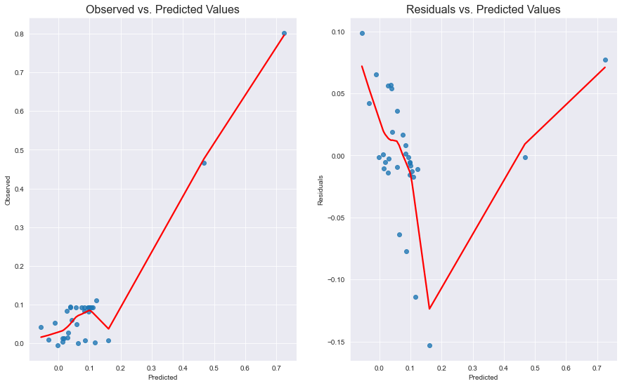
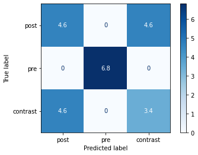

<!-- This is an html comment and this won't appear in the rendered page. You are now editing the "content" area, the core of your description. Everything that you can do in markdown is allowed below. We added a couple of comments to guide your through documenting your progress. -->


# 


<div style="text-align: center;">
   
</div>

## Background
Hypnosis can be used to study the neural correlates of consciousness. Hypnosis is defined as an experiential state of focused attention and heightened response to suggestions. Hypnotic experience can be assessed in part with the automaticity associated with hypnotic experience, with hypnotic depth and with hypnotizalibility scores. 

For a discussion about hypnosis by David Speigel, see [this link](https://www.youtube.com/watch?v=PctD-ki8dCc).

## Data

### *Arterial spin labelling protocol*
Data Used comes from Rainville et al. (2019) and hypnosis was used during the fMRI scanning acquisition with a Simens 3T scanner.

*Outline*

>33 participants (f=17 27 y.o mean)
>
>* 2 resting state scans (6 minutes each)
>* Conditions : Pre-hypnosis, Post-hypnosis
>* Hypnosis-related measures  
>   - Standford hypnotizability scale (SHSS)
>   - Hypnotic depth (HDS)
>   - Hypnotic automaticity (HAS)
>   - Hypnotic experience (HEQ)
   

 A 6 minutes resting state scan was first acquired at the beginning of the protocol. Other tasks detailed in Rainville et al. (2021) were performed following the resting state acquisition, but are not used in this project. At the end of the protocol, participant took part in a 15 minutes hypnotic induction prior to a second resting state scan (6 minutes).

The functional MRI signal was **Arterial splin labeling** which measure crebral blood flow over time. Altough this signal is not as precise as the BOLD signal (lower S/N ratio), it has the advantage of being absolute and not relative to a baseline. This is particularly useful for the resting state scan, as the baseline is not well defined.


<div style="text-align: center; background-color: white; border: 1px solid #000; padding: 20px;">
   
</div>

> **Note on pain modulation* :
   Other tasks in the scanning protocol - aside from the 2 resting state scans- included conditions of verbal suggestions either to increase (hyperalgesia cond.) or to decrease (analgesia cond.) pain perception prior to a series of painful stimulation. Subjective pain was assessed after each trial of [verbal suggestion + painful stimulations]. The difference between the pain ratings in the neutral condition and the pain ratings in the analgesia/hyperalgesia condition was computed for each subject. The absolute change in pain modulation was then used as a regressor in the analysis.

### *Data availability*
   Data access is unfortunately restricted from public open access. However, it can easily be shared on demand. Please contact me at dylan.sutterlin-guindon@umontreal.ca


### *Deliverables*

1) A github repository with all the code and documentation organized in a standard way; main.py, src, scripts, images, notebooks and a README.md file.
2) A jupyter notebook with the prediction analyses and plots used in this report.


# Method


## Tools used

This project was intended to upskill in the use of the following
 * `Nilearn` to analyse fMRI data in python.
 * `Scikit-learn` for ML models appllied to functionnal connectivity measures.
 * `Jupyter notebook`.
 * `Markdown` and `Github` for  open science coding practices.
 * Python debugger `pdb`.
 * Github copilot for code autocompletion and VScode for code editing.


### Overview

1) Atlas choices and covariance estimation
2) Hypnosis-related functionnal connectivity
3) Machine learning models to predict hypnotic experience from functionnal connectivity
4) Hypnosis-related measures correlation with machine learning models


## <em>_Atlas choices and covariance estimation_</em>
___
### **Yeo et al. 7 networks**
<div style="text-align: center; background-color: White; border: 5px solid #000; padding: 0px;">
   
</div>

* **Atlas from [Yeo et al, 2011](https://www.ncbi.nlm.nih.gov/pmc/articles/PMC3181453/)**

      from nilearn import datasets
      atlas = datasets.fetch_atlas_yeo_2011()["thick_7"]


   This atlas was first chosen for its parcimony as it only comprises 7 networks. With that many ROIs, the number of possible pairs is 21 and it would not be desirable to have too much regressors in  multiple regression model where we have few samples. is a *deterministic atlas*.
   As metionned in the [nilearn docs](https://nilearn.github.io/dev/modules/generated/nilearn.datasets.fetch_atlas_yeo_2011.html) :
   
      "A deterministic atlas is a hard parcellation of the brain into non-overlaping regions, that might have been obtained by segmentation or clustering methods. These objects are represented as 3D images of the brain composed of integer values, called ‘labels’, which define the different regions."
   This implies the use of [**Nilearn.maskers.NiftiLabelsMasker**](https://nilearn.github.io/dev/modules/generated/nilearn.maskers.NiftiLabelsMasker.html) class to extract timeseries from each regions of interest (ROI).

* **Symetrical bilateral mask** 

   Since the atlas is symetrical, it is labeled bilaterally with the same label in the left and right hemispheres. When the connectivity matrix is directly computed on this atlas, it renders a symetrical connectome without inter-hemispheric connections, as illustrated in this connectome from a [nilearn tutorial](https://nilearn.github.io/dev/auto_examples/03_connectivity/plot_atlas_comparison.html#sphx-glr-auto-examples-03-connectivity-plot-atlas-comparison-py) :

   

   *Compute inter-hemispheric connectivity*

   To account for this, I had to relabel each ROI with a different label for the right hemisphere. This was done locally with the `scripts.func.make_mask_bilat(atlas)` function, that take each ROI and duplicate it with a different label for the right hemisphere. Hence, after this tweak, the atlas had 14 ROIs and the number of possible pairs is now of 91! 


### *Covariance estimation comparison* 

The covariance matrix is computed with the [**Nilearn.connectome.ConnectivityMeasure**](https://nilearn.github.io/dev/modules/generated/nilearn.connectome.ConnectivityMeasure.html) class. This class has a `kind` parameter that can be set to `covariance`, `correlation`, `partial correlation`, `tangent` or `precision`. Code example :
      
      from nilearn.connectome import ConnectivityMeasure
      correlation_measure = ConnectivityMeasure(kind='correlation')


*A word on Sparse inverse covariance (precision)*

* Citation from [6.2.1 Nilearn](https://nilearn.github.io/stable/connectivity/connectome_extraction.html ) :
>"As shown in [Smith 2011], [Varoquaux 2010], it is more interesting to use the inverse covariance matrix, ie the precision matrix. __It gives only direct connections between regions, as it contains partial covariances__, which are covariances between two regions conditioned on all the others [...] To recover well the interaction structure, a sparse inverse covariance estimator is necessary."


#### *__Pre-Hypnosis__ condition comparison of covariance / precision / correlation*
<div style="text-align: center; background-color: White; border: 1px solid #000; padding: 0px;">
   
   
   
</div>

#### *__Post-Hypnosis__ condition comparison of covariance / precision / correlation*
<div style="text-align: center; background-color: White; border: 5px solid #000; padding: 0px;">
   
   
   
</div>

### __Connectivity results from Post-pre hypnosis with yeo 7 ROIs__

### *Results from correlation estimation*
<div style="text-align: center; background-color: White; border: 5px solid #000; padding: 0px;">
   
   
   
  " alt=""/>
</div>
<div style="text-align: center; background-color: White; border: 5px solid #000; padding: 0px;">
   
  " alt=""/>
</div>


### *Fischer R to Z transfomation to compute the contrast matrix*

For the correlation estimation, since the metric used is pearson r, the values are between -1 and 1. To compute the contrast (post-pre) connectivity matrix, a substraction of the post-hypnosis matrix to the pre-hypnosis matrix was used. Since the substraction of pearson r's is not recommended, a Fischer R to Z transformation was applied on each single subject correlation matrix before the substraction. The substraction was then applied on the Z-transformed matrices. The ```numpy.arctanh``` was used for such transformation. Code example for the mean contrast matrix computation :

```
contrast_mean_matrix = np.arctanh(tmp_post_mean) - np.arctanh(tmp_pre_mean)
```
___
## **DifuMo Atlas**
   *Fine-grain atlas of functional modes for fMRI analysis*

* Article from [Dadi et al, 2020](https://www.sciencedirect.com/science/article/pii/S1053811920306121) that presents the atlas
* Can be downloaded [here](https://parietal-inria.github.io/DiFuMo/64)
* **Labels provided**

<div style="text-align: center; background-color: White; border: 5px solid #000; padding: 0px;">
   
   
</div>

## Graph theory metrics

- **Degree** : 'The weighted node degree is the sum of the edge weights for edges incident to that node'[(NetworkX docs)](https://networkx.org/documentation/stable/reference/classes/generated/networkx.Graph.degree.html)
- **Centralities**  : 'Centrality measures are a way of detecting the most important nodes in a graph. Informally, a central node is one that has a large number of connections to other nodes in the network.' [(NetworkX docs)](https://networkx.org/documentation/stable/reference/algorithms/centrality.html)


Image from 'hands‑on tutorial on network and topological neuroscience' by Centeno et al, 2022


- **Clustering** :


---

# **Results**

## **1.** Connectivity results with Difumo64 atlas     

  ### **1.1** Overview pre, post and contrast connectivity 

<div style="text-align: center; background-color: White; border: 5px solid #000; padding: 0px;">
   
   
   
   
</div>

   ### **1.2** Contrast (post-pre hyp.)
   ### **A)** _Correlation_ estimation for edge values

   **Thresholded connectome**
   <div style="text-align: center; background-color: White; border: 5px solid #000; padding: 0px;">
   
   
   </div>

   - Pair of nodes with highest edge value:

         [Middle frontal gyrus - Superior fornix and isthmus]; Z=0.1566
         [Heschl’s gyrus - Paracentral gyrus RH]; Z=0.1521
         [Middle frontal gyrus - Parieto-occipital sulcus anterior]; Z=0.1494
         [Fusiform gyrus - Cingulate cortex posterior]; Z=0.1475
         [ventricles - Middle frontal gyrus]; Z=0.1466
         [Superior frontal sulcus - Dorsomedial prefrontal cortex antero-superior]; Z=0.1461
         [Middle frontal gyrus - Putamen]; Z=0.1448
         [Cerebellum I-V - Parieto-occipital sulcus anterior]; Z=0.1428
         [Middle frontal gyrus anterior - Angular gyrus inferior]; Z=0.1419
         [Middle frontal gyrus anterior - Putamen]; Z=0.1401

   - Nodes with the most connections (>3) from the thresholded connectome:

         Paracentral lobule superior: 8 non-zero connections
         Caudate: 5 non-zero connections
         Superior frontal sulcus: 4 non-zero connections
         Heschl’s gyrus: 4 non-zero connections
         Middle frontal gyrus: 4 non-zero connections
----
**Degree** 

'The weighted node degree is the sum of the edge weights for edges incident to that node'

 <div style="text-align: center; background-color: White; border: 5px solid #000; padding: 0px;">
   
   
   
   </div>

    - 5% nodes with highest degree values :

      Middle frontal gyrus: 3.4630
      Angular gyrus inferior: 3.2940
      Calcarine sulcus anterior: 3.1590
      Middle frontal gyrus anterior: 3.1503


**Centrality (betweeness)**

   <div style="text-align: center; background-color: White; border: 5px solid #000; padding: 0px;">
   
   
   
   </div>

   - 5% nodes with highest density values :

         Calcarine sulcus anterior: 0.0661
         Middle frontal gyrus: 0.0584
         Parieto-occipital sulcus anterior: 0.0568


**Clustering**

<div style="text-align: center; background-color: White; border: 5px solid #000; padding: 0px;">
   
   
   
   </div>

- 5% nodes with highest density values :

      Superior parietal lobule anterior: 0.1670
      Paracentral lobule: 0.1635
      Paracentral lobule superior: 0.1519


### **B) Precision (inv. sparse cov.) estimation**


   **Thresholded connectome**
   <div style="text-align: center; background-color: White; border: 5px solid #000; padding: 0px;">
   
   
   </div>

   - Pair of nodes with highest edge value:

         [Occipital pole - Paracentral lobule superior]; Z=0.1647
         [Paracentral lobule - Paracentral lobule superior]; Z=0.1628
         [Occipital pole - Paracentral gyrus RH]; Z=0.1596
         [Fusiform gyrus - Occipital pole]; Z=0.1588
         [Intraparietal sulcus RH - Superior parietal lobule anterior]; Z=0.1573
         [Paracentral lobule superior - Precuneus superior]; Z=0.1556
         [Cingulate gyrus mid-anterior - Calcarine sulcus anterior]; Z=0.1486
         [Superior temporal sulcus with angular gyrus - Paracentral lobule]; Z=0.1475
         [Middle temporal gyrus - Heschl’s gyrus]; Z=0.1457
         [Inferior frontal sulcus - Descending occipital gyrus]; Z=0.1444
         [Superior parts of Postcentral and Precentral gyri - Paracentral lobule superior]; Z=0.1433
      -------Negative edges-------

         [Fusiform gyrus posterior - Inferior occipital gyrus]; Z=-0.2077
         [Fusiform gyrus - Cerebellum Crus II]; Z=-0.2096
         [Occipital pole - Descending occipital gyrus]; Z=-0.2570
         [Occipital pole - Inferior occipital gyrus]; Z=-0.2711

   - Nodes with the most connections (>3) from the thresholded connectome:

         Occipital pole: 7 non-zero connections
         Calcarine cortex posterior: 4 non-zero connections
         Superior temporal sulcus with angular gyrus: 4 non-zero connections
         Paracentral lobule superior: 4 non-zero connections

----

**Density**
   <div style="text-align: center; background-color: White; border: 5px solid #000; padding: 0px;">
   
   
   
   </div>

   - 5% nodes with highest density values(pos. and neg. values) :

         Paracentral lobule superior: 0.7882
         Superior occipital gyrus: -0.6706
         Parieto-occipital sulcus middle: -0.6943


___
# <em>Inter-subject connectivity analysis </em>
## <em>Prediction of hypnosis-related variables </em>

One of the main objective of this project was to assess if changes in functional connectivity during hypnosis can predict behavioral changes in hypnotic-related variables.

**Variables used** : 
- ['SHSS_score', 'raw_change_ANA','raw_change_HYPER', "Abs_chge_pain_hypAna", "Chge_hypnotic_depth", "Mental_relax_absChange", 'Automaticity_post_ind',"Abs_diff_automaticity"]
- Change in hypnotic depth 
- Absolute change in _mental relaxation_ 
- Absolute change in the _feeling of automaticity_ 
- Absolute change in _pain modulation_ (Hyperalgesia cond. from neutral cond.)*
- Absolute change in _pain modulation_ (Analgesia cond.from neutral cond.)*

### **Regression models**

Metrics used (Mean metrics of cross-validation predictions): 
   - Mean Pearson's r for correlation between VD values and models predicted scores
   - Mean RMSE
   - Mean MAE
   - Mean R2

### A) Correlation estmiation with Difumo64 atlas


### *Steps of the analysis*
1. Vectorize half of the connectivity matrices for each subject and concatenate in a numpy array of shape (n_subjects, n_features). Example of code used for the vectorization :

   ```
   # Triangular lower masker on connectivity matrix
   M = results["pre_connectomes"]
   tril_mask = np.tril(np.ones(M.shape[-2:]), k=-1).astype(bool)

   # Stack the vectorized matrices 
   results["X"] = np.stack(M[i][..., tril_mask] for i in range(0, len(M)),axis=0)

   ```
2. Principal component analysis (0.80% explained variance) was applied to the feature matrix to reduce the dimensionality of the data, because multiple regression is not suited when nb. of features > nb. of subjects. 

   ```
   from sklearn.decomposition import PCA
   pca = PCA(n_components=0.80)
   results["X_pca"] = pca.fit_transform(results["X"])
   ```
3. Multiple regession with **Ordinary Least Square** (OLS) estimator was used to predict the change in hypnosis-related variables with the contrast (post-pre) connectivity.

         # Ordinary Least Sqaure estimator
         from statsmodels.api import OLS

4. Correct for multiple comparisons with **False Discovery Rate** (FDR)

         # FDR correction
         from statsmodels.stats.multitest import fdrcorrection

### *Regression results*
> Prediction of **change in hypnotic depth** with Post-pre covariance
   
      Feature 0 is significant (p < 0.05) with FDR correction
      Feature 4 is significant (p < 0.05) with FDR correction
      Feature 10 is significant (p < 0.05) with FDR correction
      Feature 12 is significant (p < 0.05) with FDR correction
      Feature 13 is significant (p < 0.05) with FDR correction
      Feature 16 is significant (p < 0.05) with FDR correction

> *Linear assumptions!*
- Predicted vs observed values | Residuals vs predicted values plot for significant regressors
      



We notice that the residuals are not normally distributed, and that the variance is not constant (right plot). This indicates that the linear assumptions are not met.


## <em>Machine learning classification</em>

### Classification between connectivity matrices from pre, post and post-pre conditions


      x1 = dict_features['post']
      x2 = dict_features['pre']
      x3 = dict_features['contrast']
      y_cond = np.concatenate((np.zeros(x1.shape[0]), np.ones(x2.shape[0]),
       np.full(x3.shape[0], 2)),axis=0)
      X = np.concatenate((x1, x2, x3), axis=0)
   Dim. of x1,x2,x3 _(n_subjects, n_features)_  : (32, 2016), (32, 2016), (32, 2016) 
   **X shape = (96, 2016)**

### **Multiclass condition**
* Algorithms : 
   * Ensemble classifier : VotingClassifier
      * LogisticRegression
      * RandomForestClassifier
      * SVC

* Metrics : 
   - Ensemble classifier cross val. scores : [0.83%, 0.54%, 0.63%, 0.63%, 0.67%]
   - Only SVC cross val scores : ['0.67%', '0.71%', '0.79%', '0.62%', '0.62%']
         
   **SVC mean confusion matrix :**


```{warning}
Note that binary classification is giving 100% accuracy. This is most likely biased! Eventhough I made sure not to make the common mistake of testing on train data, there is probably some noise pattern specific to each run that the model uses to make such a neat distinction. Overall, this model is not very useful, because classifying two runs appart is not very informative on brain connectivity.
```


___
## <em>Seed-to-ROIs connectivity  </em>

### 


<br/>

> //information_source: all classifiers were trained and tested on the **connectome**. Next, the plan is to train classifiers on the beta maps of the GLM//. 


## About the Author

I am begining a master in psychology at the University of Montréal. 


## Acknowledgement

Thank you to all the BHS teaching assistants for the support and great advices on this project and also to the organizers who made such a wonderful course possible.

</div>


# Supplemental material/figures

## 1.2 A)

### Comparison of 5% highest edge density post (correl. estim.)


   Parieto-occipital sulcus superior: 0.30290769035702064
   Superior parietal lobule posterior: 0.2847421670281322
   Precuneus anterior: 0.27548093040763855
   Cingulate gyrus mid-posterior: 0.2749985525257869
   Parieto-occipital sulcus anterior: 0.2708608648412702

